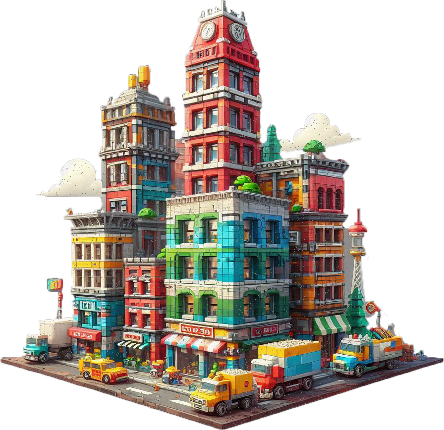

  

<!-- Short Introduction -->

<h1 align = "left">
  Hi, there. 

   ### Thanks for visiting :heart:
  
  &emsp;
  
</h1>

I am a software engineer who can push the envelope, with a wealth of experience in web and mobile development, as well as DevOps engineering. I am adept at leveraging technologies like Docker and Kubernetes, and I am well-versed in the cloud technology realm, such as AWS, with a deep well of knowledge and substantial experience in my toolkit.

#### Web Development

-   Basic: JavaScript, TypeScript, Python, Java, Ruby on Rails, Golang, C#, C++
-   Front-End: React.js, Next.js, Redux, Zustand, AngularJS, Vue.js, Nuxt.js
-   Back-End: Node.js, Express.js, Nest.js, Python, Django, Flask, Laravel, Java, Spring Boot, Ruby on Rails, .Net
-   Database: MySQL, PostgreSQL, Oracle, SQLite, MongoDB
-   Tools: Jira, Trello

#### Mobile Development

-   React Native/Ionic
-   Flutter/FlutterFlow
-   Swift
-   Kotlin
-   Bubble.io, 

#### DevOps Engineering

-   Docker, Kubernetes, Ngnix, GitHub, Jenkins
-   Terraform, CDK, CloudFormation, Pulumi
-   Amazon Web Services(AWS Lambda, API Gateway, EC2, S3, EKS, ECS, Secret Manager, SNS, SES, Route53, AWS RDS, DynamoDB, etc)
-   Google Cloud Platform
-   Microsoft Azure

I can't acclimate with 99.(9)%, Only by sending 100% perfect project my Clients!

<!-- Skills Section -->
<h2 align="left">🚀Skills🚀</h2>

#### 🔥Major Programming Languages:

  

    
  

#### ⛓️Frameworks and Skills:

  
      
    
    
  

  
#### 🧵Database & Skills:

  
      
    
  

#### ⚡️Other Essentials:

  
      
    
  

<h2>Welcome to my Git.</h2>

I am a senior Full-stack developer who has strong command over both front-end and back-end technologies.

<h2>  My highlights  </h2>
  
✔Front End Development (React, Next.js, Vue.js)

  
✔End Development (Node, Express, Python, Django, Laravel)

  
✔Database Management (PostgreSQL, MySQL, MongoDB)

  
✔API Architectures and Integrations (RESTful API, GraphQL, Google APIs, ChatGPT APIs)

  
✔CMS (Wordpress themes, plugins, Woocommerce, Shopify)

<h2>  Additional skills  </h2>
  
✔Pure Coding (Python, Javascript/Typescript)

  
✔UI/UX design (Figma, Responsive UI, Bootstrap, TailwindCSS, Material UI)

  
✔Mobile App Development (React Native, Swift, Flutter)

  
✔Cloud Platform and Deployment (Docker,  AWS, Azure, Firebase)

<h2>  Languages & Frameworks & Tools & Abilities  </h2>

  <code></code>
  <code></code>
  <code></code>
  <code></code>
  <code></code>
  <code></code>
  <code></code>
  <code></code>
  <code></code>
  <code></code>
  <code></code>
  <code></code>
  <code></code>
  <code></code>
  <code></code>
  <code></code>
  <code></code>
  <code></code>
  <code></code>
  <code></code>
  <code></code>
  <code></code>
  <code></code>
  <code></code>
  <code></code>
  <code></code>
  <code></code>

<h2>  Interest  </h2>

  <code></code>
  <code></code>
  

