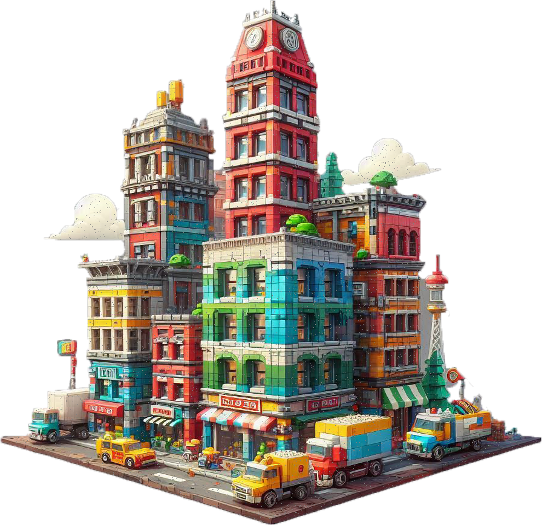

<!-- Short Introduction -->

<h1 align = "left">
  Hi 

  ### Welcome to my Git :heart:
</h1>
<p>Over 10 years of experience as AI/ML tailored software engineer</p>

```yaml

current_job: Software Developer
education:
  [
    "Bachelor's in Computer Science",
  ]
technical_skills:
  [
    Basic: ["JavaScript", "TypeScript", "C#", "Python", "Go", "PHP"]
    Front-End: ["React.js", "Next.js", "Angular","Vue", "Blazor"]
    AI integration: ["GenAI&OpenAI API", "NLP", "Langchain" ,"VectorDB", "ElasticSearch", "PyTorch", "Tensorflow"]
    Back-End: ["Node.js", "ASP.NET", ".NET Framework", "Django", "Laravel", "FastAPI"]
    CMS: ["Wordpress", "Drupal", "Shopify"]
    Database: ["Microsoft SQL Server", "MySQL", "PostgreSQL", "MongoDB", "Redis"]
    Cloud&DevOps: ["AWS", "Docker", "GCP", "Azure", "Kubernetes" ,"Terraform" "CI/CD"]
    Methodologies: ["Agile", "Microservices", "Slack"]
  ]
technical_background:
  [
    "AI/ML Engineer",
    "Full Stack Engineer",
    "DevOps Solutions Architect",
  ]
hobbies: ["Chess", "LEGO building", "Swimming", "Sketching"]
```
<!-- Skills Section -->
<h2 align="left">🚀Skills🚀</h2>

<div>

#### ⚒Basic Programming Languages:

  <div align="left">
    
    
    
    
    
    
  </div>

#### 🛒Frameworks:

  <div align="left">      
    
    
    
    
    
    
    
  </div>
  
#### 🎲Database & DevOps & Deploys:

  <div align="left">      
    
    
    
    
    
    
    
  </div>
  
#### 🎨Interests:
<p>
  <code></code>
  <code></code>
</p>
<hr>
